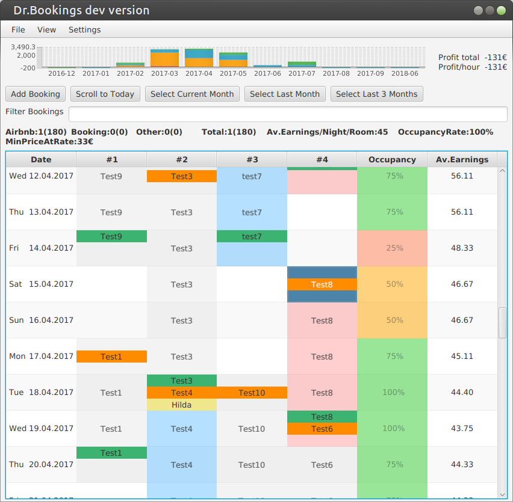
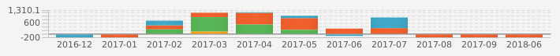
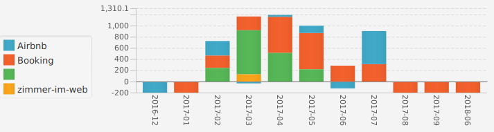
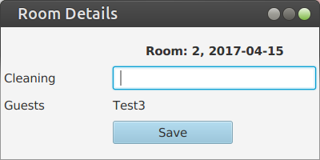
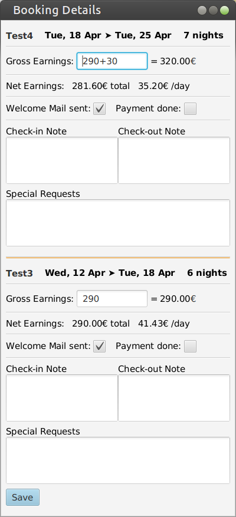

# Dr.Bookings

### Booking managment through a rich graphical interface.

## Features

+ Graphical managment of bookings from Airbnb, Booking and others.
+ Managment of cleaning: Reminders and cleaning plan export.
+ Data import from iCal and xlsx.
+ Gross earnings, net earnings and expenses.
+ [Performance calculation](https://github.com/DrBookings/drbookings/wiki/Profit-Calculation) (earnings compared to another reference earning).
+ Check-in/ Check-out notes/ times and reminders.

## Documentation

[Wiki](https://github.com/DrBookings/drbookings/wiki)

## Screenshots

